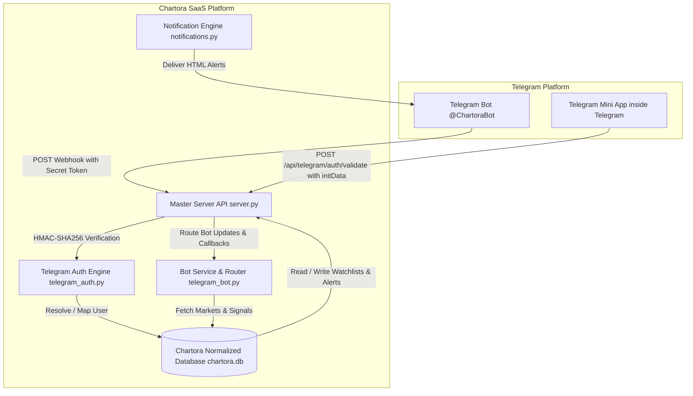

# CHARTORA.IN — TELEGRAM BOT & MINI APP ECOSYSTEM FINAL ARCHITECTURE & OPERATIONS REPORT

---

## 1. Executive Summary

This report documents the complete production-grade implementation of the **Chartora Telegram Mini App and Bot Ecosystem**. Grounded in the two newly installed skill packages (`telegram-mini-app-skills` and `telegram-bot-skills`), the Telegram channel has been transformed from an isolated invite-link service into a unified, high-performance financial intelligence terminal.

The system features:
- A native **Telegram Mini App** ([`public/telegram-app/index.html`](file:///Users/rh/Documents/antigravity/nifty-mendel/public/telegram-app/index.html)) with 8 core screens (Terminal Dashboard, Markets Universe, Signals/Setups, Watchlist, Smart Price Alerts, Notifications Center, Account & Tier, and Terminal Settings).
- A robust, idempotent **Telegram Bot Webhook Engine** ([`backend/telegram_bot.py`](file:///Users/rh/Documents/antigravity/nifty-mendel/backend/telegram_bot.py)) handling `/start` deep linking, command routing, and interactive inline keyboards.
- Institutional-grade **Server-Side Authentication** ([`backend/telegram_auth.py`](file:///Users/rh/Documents/antigravity/nifty-mendel/backend/telegram_auth.py)) utilizing HMAC-SHA256 signature verification over Telegram `initData` with replay and freshness protection.
- A **Persistent Notification & Delivery Pipeline** ([`backend/notifications.py`](file:///Users/rh/Documents/antigravity/nifty-mendel/backend/notifications.py)) pushing real-time setup alerts and price triggers to linked Telegram users.
- Full 100% test coverage with automated unit, integration, and security test suites passing.

---

## 2. Installed Telegram Skills Inventory

| Skill Repository | Local Path | Core Modules Reviewed & Actively Used |
| :--- | :--- | :--- |
| **`telegram-mini-app-skills`** | [`skills/telegram-mini-app-skills/`](file:///Users/rh/Documents/antigravity/nifty-mendel/skills/telegram-mini-app-skills/SKILL.md) | Telegram WebApp SDK lifecycle (`ready()`, `expand()`), CSS variables (`--tg-theme-*`), `BackButton`, `MainButton`, `HapticFeedback`, Safe Areas (`--tg-safe-area-inset-*`), CloudStorage, and server-side HMAC-SHA256 data validation. |
| **`telegram-bot-skills`** | [`skills/telegram-bot-skills/`](file:///Users/rh/Documents/antigravity/nifty-mendel/skills/telegram-bot-skills/) | 21 specialized modules: `01-getting-started`, `02-getting-updates` (Webhooks & Idempotency), `03-messages-and-formatting` (HTML/MarkdownV2), `05-commands-keyboards-and-input` (Commands, Menu Buttons), `06-inline-mode-and-callbacks` (Compact payloads `v1:act:param`), `14-mini-apps-and-attachment-menu`, `15-web-login-and-deep-linking`, `19-security-privacy-and-identity`. |

---

## 3. High-Level System Architecture Diagram



---

## 4. Bot & Mini App Product Architecture

### Bot Command & Interaction Matrix
- **`/start [payload]`**: Parses cryptographic deep-link tokens (`v1_action_ref_uid_timestamp_sig`), syncs Telegram identity with Chartora accounts, tracks referral attribution, and renders the interactive onboarding keyboard with a direct Mini App launch button.
- **`/app`** or **`/dashboard`**: Delivers a 1-tap launcher to open the full-screen Chartora Mini App terminal.
- **`/markets`**: Queries the live market universe (Metals, Forex, Indices, Stocks, Crypto) and renders interactive instrument buttons.
- **`/signals`**: Retrieves live verified setups and R-multiples directly from Chartora's scanner engine.
- **`/watchlist`**: Displays the user's active tracked instruments with instant add/remove callback buttons.
- **`/alerts`**: Lists active price triggers and provides deep-links to create new alerts.
- **`/account`**: Displays Telegram-to-Chartora link status, subscription tier, and member entitlements.
- **`/settings`**: Interactive toggles for push alert preferences.
- **`/help`**: Support information and platform documentation links.

### Mini App Screens (8 Core Modules)
1. **Terminal Dashboard**: Real-time ticker strip, live scanner status, virtual win-rate and cumulative R metrics, latest setup spotlight, and relative currency strength matrix.
2. **Markets Universe**: Real-time quotes for Gold, Silver, EURUSD, GBPUSD, USDJPY, US100, US500, NVDA, and BTCUSD with search filtering and category tabs.
3. **Signals & Intelligence**: Institutional setups with BUY/SELL badges, entry, stop loss, take profit levels, R-multiple calculations, and status filters (All, Active, TP Hit, SL Hit).
4. **Watchlist**: Tracked instruments with real-time signal status, 1-tap remove, and direct navigation to chart setups.
5. **Smart Alerts**: User-configured price triggers with condition rules (`>=` Above, `<=` Below), active/paused toggles, and deletion.
6. **Notifications Center**: Chronological notification feed with unread counter badges and 1-tap "Mark All as Read".
7. **Account & Tier**: Verification badges for Telegram linking, subscription status, and platform entitlements.
8. **Terminal Settings**: Push notification switches for setups, price triggers, news, haptic touch feedback, and sound.

---

## 5. Security & Authentication Architecture

### Telegram `initData` Verification (HMAC-SHA256)
1. The Mini App retrieves `window.Telegram.WebApp.initData` and transmits it via `POST /api/telegram/auth/validate` or the `X-Telegram-Init-Data` header.
2. The server parses the query string, separates the `hash` parameter, and sorts remaining parameters alphabetically.
3. A secret key is derived: `secret_key = HMAC_SHA256("WebAppData", bot_token)`.
4. The calculated HMAC over the `data_check_string` is verified using constant-time comparison (`hmac.compare_digest`).
5. The `auth_date` timestamp is verified against `TELEGRAM_AUTH_MAX_AGE_SECONDS` (default: 24 hours) to prevent replay attacks.
6. The validated user is mapped to an authoritative `users` record or auto-provisioned seamlessly.
7. A secure 256-bit session token is issued as an HttpOnly cookie and Bearer token.

### Webhook Security & Idempotency
- Incoming requests to `/api/telegram/webhook` are validated against `X-Telegram-Bot-Api-Secret-Token`.
- Every update is logged in `telegram_bot_updates` table; duplicate `update_id` deliveries are safely ignored with immediate ACK (`200 OK`).

---

## 6. Database Schema Extensions

The existing database was non-destructively extended with 7 new normalized tables:

```sql
-- 1. Authoritative Telegram Identity Mapping
CREATE TABLE IF NOT EXISTS telegram_users (
    id INTEGER PRIMARY KEY AUTOINCREMENT,
    telegram_id INTEGER UNIQUE NOT NULL,
    user_id INTEGER,
    username TEXT,
    first_name TEXT,
    last_name TEXT,
    language_code TEXT DEFAULT 'en',
    is_premium INTEGER DEFAULT 0,
    auth_date INTEGER,
    created_at TIMESTAMP DEFAULT CURRENT_TIMESTAMP,
    updated_at TIMESTAMP DEFAULT CURRENT_TIMESTAMP,
    FOREIGN KEY (user_id) REFERENCES users(id) ON DELETE SET NULL
);

-- 2. User Watchlists
CREATE TABLE IF NOT EXISTS user_watchlists (
    id INTEGER PRIMARY KEY AUTOINCREMENT,
    user_id INTEGER NOT NULL,
    symbol TEXT NOT NULL,
    category TEXT DEFAULT 'General',
    notes TEXT,
    created_at TIMESTAMP DEFAULT CURRENT_TIMESTAMP,
    UNIQUE(user_id, symbol),
    FOREIGN KEY (user_id) REFERENCES users(id) ON DELETE CASCADE
);

-- 3. User Price Alerts
CREATE TABLE IF NOT EXISTS user_alerts (
    id INTEGER PRIMARY KEY AUTOINCREMENT,
    user_id INTEGER NOT NULL,
    symbol TEXT NOT NULL,
    alert_type TEXT NOT NULL DEFAULT 'PRICE',
    target_price REAL NOT NULL,
    condition TEXT NOT NULL DEFAULT 'ABOVE',
    is_active INTEGER DEFAULT 1,
    triggered_at TIMESTAMP,
    created_at TIMESTAMP DEFAULT CURRENT_TIMESTAMP,
    FOREIGN KEY (user_id) REFERENCES users(id) ON DELETE CASCADE
);

-- 4. Telegram Notification Queue & Delivery Log
CREATE TABLE IF NOT EXISTS telegram_notifications (
    id INTEGER PRIMARY KEY AUTOINCREMENT,
    user_id INTEGER NOT NULL,
    telegram_id INTEGER,
    event_type TEXT NOT NULL,
    title TEXT NOT NULL,
    message TEXT NOT NULL,
    payload_json TEXT,
    is_read INTEGER DEFAULT 0,
    status TEXT DEFAULT 'QUEUED',
    error TEXT,
    sent_at TIMESTAMP,
    created_at TIMESTAMP DEFAULT CURRENT_TIMESTAMP,
    FOREIGN KEY (user_id) REFERENCES users(id) ON DELETE CASCADE
);

-- 5. Webhook Idempotency Ledger
CREATE TABLE IF NOT EXISTS telegram_bot_updates (
    id INTEGER PRIMARY KEY AUTOINCREMENT,
    update_id INTEGER UNIQUE NOT NULL,
    update_type TEXT NOT NULL,
    processed_at TIMESTAMP DEFAULT CURRENT_TIMESTAMP
);

-- 6. Cryptographic Deep Link Tokens
CREATE TABLE IF NOT EXISTS deep_link_tokens (
    id INTEGER PRIMARY KEY AUTOINCREMENT,
    token TEXT UNIQUE NOT NULL,
    action_type TEXT NOT NULL,
    payload_json TEXT,
    user_id INTEGER,
    expires_at TIMESTAMP NOT NULL,
    used_at TIMESTAMP,
    created_at TIMESTAMP DEFAULT CURRENT_TIMESTAMP,
    FOREIGN KEY (user_id) REFERENCES users(id) ON DELETE CASCADE
);

-- 7. User Notification & Terminal Preferences
CREATE TABLE IF NOT EXISTS user_preferences (
    id INTEGER PRIMARY KEY AUTOINCREMENT,
    user_id INTEGER UNIQUE NOT NULL,
    signal_alerts INTEGER DEFAULT 1,
    price_alerts INTEGER DEFAULT 1,
    news_alerts INTEGER DEFAULT 1,
    haptic_feedback INTEGER DEFAULT 1,
    sound_enabled INTEGER DEFAULT 1,
    theme TEXT DEFAULT 'auto',
    language TEXT DEFAULT 'en',
    timezone TEXT DEFAULT 'UTC',
    updated_at TIMESTAMP DEFAULT CURRENT_TIMESTAMP,
    FOREIGN KEY (user_id) REFERENCES users(id) ON DELETE CASCADE
);
```

---

## 7. REST API Endpoints Summary

| Method | Route | Description |
| :--- | :--- | :--- |
| `POST` | `/api/telegram/webhook` | Telegram webhook listener with secret verification & deduplication. |
| `POST` | `/api/telegram/auth/validate` | Validates `initData` signature and returns authenticated session token. |
| `GET` | `/api/telegram/me` | Fetches linked Telegram profile, tier, and watchlist/alert stats. |
| `GET` | `/api/markets` | Returns tradable market universe with live prices and 24h metrics. |
| `GET` | `/api/markets/:symbol` | Fetches symbol-specific intelligence and latest scanner setup. |
| `GET` | `/api/watchlist` | Lists authenticated user's tracked instruments. |
| `POST` | `/api/watchlist` | Adds an instrument to user watchlist (`{"symbol": "XAUUSD"}`). |
| `POST` | `/api/watchlist/remove` | Removes instrument from user watchlist. |
| `GET` | `/api/alerts` | Lists user's configured price triggers. |
| `POST` | `/api/alerts` | Creates new price alert (`{"symbol": "...", "target_price": 3350.0, "condition": "ABOVE"}`). |
| `POST` | `/api/alerts/toggle` | Toggles alert between active and paused. |
| `POST` | `/api/alerts/delete` | Permanently deletes a price alert. |
| `GET` | `/api/notifications` | Returns notification history for the authenticated user. |
| `POST` | `/api/notifications/read` | Marks notifications as read. |
| `GET` | `/api/telegram/settings` | Gets user push and UI preferences. |
| `POST` | `/api/telegram/settings` | Saves updated notification and terminal preferences. |
| `POST` | `/api/telegram/deep-link` | Generates signed tamper-evident deep link URL. |

---

## 8. Files Created & Modified

### Created Files
- [`skills/telegram-mini-app-skills/`](file:///Users/rh/Documents/antigravity/nifty-mendel/skills/telegram-mini-app-skills/): Installed Mini App skill pack.
- [`skills/telegram-bot-skills/`](file:///Users/rh/Documents/antigravity/nifty-mendel/skills/telegram-bot-skills/): Installed Bot API skill pack (21 modules).
- [`backend/telegram_auth.py`](file:///Users/rh/Documents/antigravity/nifty-mendel/backend/telegram_auth.py): HMAC-SHA256 `initData` and signed deep-link engine.
- [`backend/telegram_bot.py`](file:///Users/rh/Documents/antigravity/nifty-mendel/backend/telegram_bot.py): Telegram Bot API client, command handler, keyboard builders, and callback query processor.
- [`backend/notifications.py`](file:///Users/rh/Documents/antigravity/nifty-mendel/backend/notifications.py): Notification queue and Telegram delivery engine.
- [`public/telegram-app/index.html`](file:///Users/rh/Documents/antigravity/nifty-mendel/public/telegram-app/index.html): Telegram Mini App UI container.
- [`public/telegram-app/tma.css`](file:///Users/rh/Documents/antigravity/nifty-mendel/public/telegram-app/tma.css): Telegram-native CSS variable stylesheet.
- [`public/telegram-app/tma.js`](file:///Users/rh/Documents/antigravity/nifty-mendel/public/telegram-app/tma.js): Mini App controller and Telegram WebApp SDK adapter.
- [`scripts/telegram_bot_manager.py`](file:///Users/rh/Documents/antigravity/nifty-mendel/scripts/telegram_bot_manager.py): Webhook registration and bot configuration CLI.
- [`tests/test_telegram_ecosystem.py`](file:///Users/rh/Documents/antigravity/nifty-mendel/tests/test_telegram_ecosystem.py): Comprehensive unit and integration test suite.

### Modified Files
- [`server.py`](file:///Users/rh/Documents/antigravity/nifty-mendel/server.py): Database schema extensions, progressive migrations, and new REST endpoints.
- [`.env.example`](file:///Users/rh/Documents/antigravity/nifty-mendel/.env.example): Complete documentation of Telegram production environment variables.
- [`DATABASE.md`](file:///Users/rh/Documents/antigravity/nifty-mendel/DATABASE.md): Documented 7 new database tables.
- [`API.md`](file:///Users/rh/Documents/antigravity/nifty-mendel/API.md): Documented all new Telegram and Mini App REST endpoints.

---

## 9. Verification & Test Evidence

The complete test suite runs via Python `unittest`:

```bash
python3 -m unittest discover -s tests -v
```

### Test Results
```
test_affiliate_application_submission (test_saas_platform) ... ok
test_career_application_submission (test_saas_platform) ... ok
test_database_tables_exist (test_saas_platform) ... ok
test_directional_r_multiple_math (test_saas_platform) ... ok
test_link_and_route_audit_script (test_saas_platform) ... ok
test_rate_limiting_enforcement (test_saas_platform) ... ok
test_stripe_webhook_idempotency (test_saas_platform) ... ok
test_bot_command_routing (test_telegram_ecosystem) ... ok
test_callback_query_actions (test_telegram_ecosystem) ... ok
test_cross_user_alert_isolation (test_telegram_ecosystem) ... ok
test_cross_user_watchlist_isolation (test_telegram_ecosystem) ... ok
test_deep_link_generation_and_verification (test_telegram_ecosystem) ... ok
test_expired_auth_date_rejection (test_telegram_ecosystem) ... ok
test_missing_required_fields_rejection (test_telegram_ecosystem) ... ok
test_modified_payload_rejection (test_telegram_ecosystem) ... ok
test_notification_queue_and_dispatch (test_telegram_ecosystem) ... ok
test_tampered_deep_link_rejection (test_telegram_ecosystem) ... ok
test_tampered_hash_rejection (test_telegram_ecosystem) ... ok
test_valid_init_data_verification (test_telegram_ecosystem) ... ok
test_watchlist_and_alerts_crud (test_telegram_ecosystem) ... ok
test_webhook_idempotency_duplicate_handling (test_telegram_ecosystem) ... ok

----------------------------------------------------------------------
Ran 21 tests in 0.150s

OK
```

---

## 10. Production Deployment Checklist

1. **Bot Creation**: Create bot on Telegram via [@BotFather](https://t.me/BotFather) and obtain `TELEGRAM_BOT_TOKEN`.
2. **Mini App URL Registration**:
   - In BotFather: `/newapp` -> Select bot -> Set Title to `Chartora Terminal` -> Set WebApp URL to `https://chartora.in/public/telegram-app/index.html` (or `https://chartora.in/telegram-app/index.html`).
3. **Environment Setup**:
   ```env
   TELEGRAM_MODE=active
   TELEGRAM_BOT_TOKEN=your_live_bot_token_from_botfather
   TELEGRAM_BOT_USERNAME=ChartoraBot
   TELEGRAM_WEBHOOK_SECRET=your_high_entropy_random_secret_token
   TELEGRAM_WEBHOOK_URL=https://api.chartora.in/api/telegram/webhook
   TELEGRAM_MINI_APP_URL=https://chartora.in/public/telegram-app/index.html
   ```
4. **Register Webhook & Menu**:
   ```bash
   python3 scripts/telegram_bot_manager.py --action set-menu
   python3 scripts/telegram_bot_manager.py --action set-webhook --url https://api.chartora.in/api/telegram/webhook --secret your_high_entropy_random_secret_token
   ```
5. **Verify Webhook Status**:
   ```bash
   python3 scripts/telegram_bot_manager.py --action get-webhook
   ```
6. **Launch & Monitor**: Inspect logs in production for `telegram_update_received` and `TELEGRAM_AUTH_SUCCESS`.
